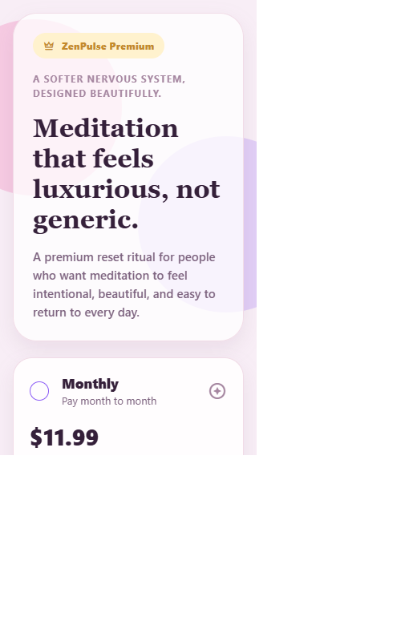
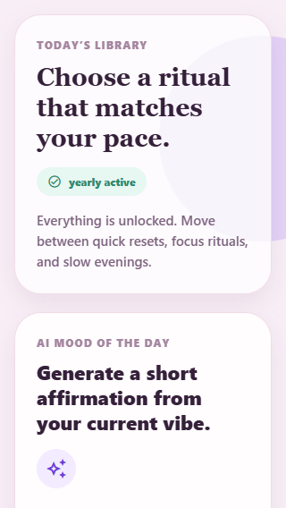
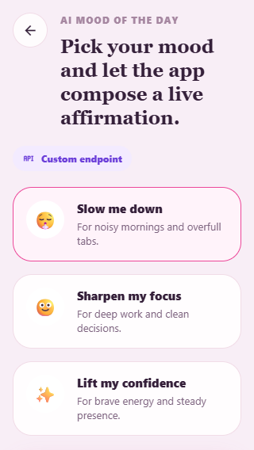
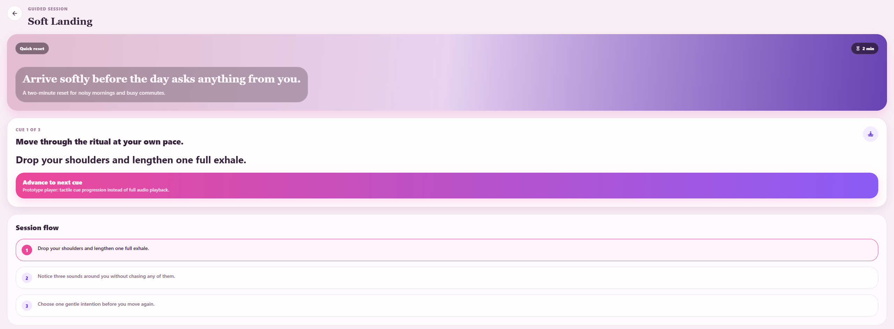

# ZenPulse: AI Meditation App

Luxury wellness prototype built for the mobile test task with `React Native + Expo + TypeScript`.

[Русская версия / Russian version](./README.ru.md)

## Reviewer quick guide

If you only open this repository link, you can review the whole submission from GitHub:

- code and commit history
- screenshots in `assets/demo/`
- video materials in `assets/demo/videos/`
- setup / testing instructions
- the control-question answer about mobile layout risks and AI supervision

GitHub will preview the uploaded `.mp4` files after you click their links below.

## Assignment coverage

### 1. Paywall screen

- bright premium visual direction with a luxury meditation tone
- two plans: `Monthly` and `Yearly`
- the `Yearly` option is highlighted as the better-value choice
- `Try premium free for 7 days` simulates a successful purchase and unlocks premium content

### 2. Meditations home screen

- list of meditation cards with artwork-like gradients and duration metadata
- free / premium gating is implemented in UI and route logic
- when `isSubscribed = false`, locked premium cards stay tappable but redirect back to the paywall

### 3. AI Mood of the day

- three mood choices
- affirmation generation is driven by an LLM prompt
- the app supports a configurable endpoint and a local proxy for deterministic demos
- generated content is persisted locally

### 4. Mobile UX requirements

- `SafeAreaView` on primary screens
- compact layout handling for narrow widths
- touch-friendly targets
- scroll-first layouts instead of brittle fixed-height marketing compositions

## What is included

- Premium `Paywall` with monthly / yearly plans and a highlighted best-value option
- `Meditations` home screen with locked premium cards and paywall redirect logic
- Dedicated `Session` screen for unlocked rituals with a tactile cue-by-cue prototype player
- `AI Mood of the day` flow with 3 moods, live text generation, error states, and local persistence
- `SafeAreaView` on top/bottom, compact-screen adjustments, and touch targets sized for mobile use
- AsyncStorage persistence for subscription state, selected plan, and the latest affirmation

## Stack

- Expo SDK 55
- Expo Router
- React Native Safe Area Context
- Expo Linear Gradient
- Expo Haptics
- AsyncStorage

## Run locally

```bash
npm install
```

Recommended terminal #1:

```bash
npm run ai-proxy
```

Recommended terminal #2:

```bash
npx expo start
```

Optional browser preview:

```bash
npx expo start --web --port 19006
```

Validation commands:

```bash
npm run typecheck
npm run doctor
```

## AI setup

The app supports two live-generation paths:

1. `Recommended for demos:` run `npm run ai-proxy`
2. `Optional:` point `EXPO_PUBLIC_AI_ENDPOINT` to your own server endpoint

### How dev-mode AI routing works

- If `EXPO_PUBLIC_AI_ENDPOINT` is set, the app uses it directly
- If Expo is running on `localhost` or a LAN IP and the local proxy is running, the app auto-tries `http://<expo-host>:8788/api/affirmation`
- Otherwise the app falls back to the public Pollinations demo endpoint

Create `.env.local` only if you want to force a custom endpoint:

```bash
EXPO_PUBLIC_AI_ENDPOINT=http://192.168.X.X:8788/api/affirmation
```

## How to test on a real phone

### Same Wi-Fi path (best for the recording)

1. Start `npm run ai-proxy`
2. Start `npx expo start`
3. Open Expo Go on the phone
4. Scan the QR code from the Expo terminal
5. The app should auto-detect the Expo host and use the local AI proxy

If Expo Go says the project is incompatible with the installed version, install the current Android APK directly from `https://expo.dev/go`. Store builds can lag behind Expo SDK 55 during rollout windows.

### If Expo discovery is flaky

You can use:

```bash
npx expo start --tunnel
```

Important note: tunnel mode helps deliver the bundle, but the AI request still needs a reachable endpoint. For a deterministic phone demo in tunnel mode, set:

```bash
EXPO_PUBLIC_AI_ENDPOINT=http://<YOUR_PC_LAN_IP>:8788/api/affirmation
```

Then restart Expo so the env value is embedded again.

## Suggested phone test script

1. Open the app and land on the `Paywall`
2. Tap `Continue with limited access`
3. On the library screen, tap a locked premium card and confirm it routes back to the paywall
4. Tap `Try premium free for 7 days`
5. Confirm premium cards unlock
6. Open an unlocked ritual and advance through the cue flow
7. Return to the library
8. Open `AI Mood of the day`
9. Pick a mood and generate a live affirmation
10. Reload the app and confirm the unlocked state + latest affirmation persist

## How AI handled mobile specifics

- Navigation is route-based with Expo Router: `paywall -> meditations -> session`, plus a modal-style `affirmation` flow
- All primary screens use `SafeAreaView` with top/bottom edges enabled
- The UI switches into a compact mode below `360px` width using `useWindowDimensions`
- Locked content is enforced both on the library cards and on direct session routes
- Long-form content stays scroll-first instead of relying on fixed-height hero layouts

## Control question

### "What mobile layout problems does AI handle worst, and how did you control it so the app did not break on iPhone SE vs Pro Max?"

AI usually struggles most with:

- vertical density on small phones when marketing copy, pricing cards, and CTA buttons compete for the same viewport
- Safe Area collisions near the notch / home indicator
- oversized headings that look elegant on Pro Max but become greedy on iPhone SE
- touch-target sizing when the layout gets compressed
- route logic details such as "locked card must still be tappable, but must redirect to paywall instead of opening premium content"

How I controlled it in this prototype:

- used `SafeAreaView` on every main screen
- manually smoke-tested a narrow `320px` viewport during development
- added compact responsive adjustments under `360px`
- kept critical actions in a scrollable column rather than forcing everything above the fold
- added explicit accessibility roles / labels for plans, mood choices, and primary CTAs
- guarded premium session routes in code, not just visually

## Screenshots

### Paywall



### Meditation library



### AI mood flow



### Ritual session



## Video materials

### 1. AI prompting and redesign iteration (desktop)

This video documents the prompt-engineering part of the assignment:

- desktop workflow while prompting GitHub Copilot
- describing the desired premium meditation style and UI direction
- asking the AI to fix a real readability issue on the meditation cards
- demonstrating how AI guidance was corrected, not accepted blindly

https://github.com/user-attachments/assets/12c30598-9176-4abd-8088-ce726a0b60c5

### 2. Functional device walkthrough — initial flow

This video covers the first complete app pass on a real device:

- opening the app on the `Paywall`
- using the limited-access path
- tapping locked premium cards — confirm they redirect back to paywall
- activating the simulated free trial and unlocking premium access
- validating the core `isSubscribed` logic required by the task

https://github.com/user-attachments/assets/6f1304ec-1e9a-4f27-9ad3-1222235e3461

### 3. Functional device walkthrough — post-redesign premium state

This video shows the app after the readability and visual polish pass:

- revisiting meditation cards after the contrast redesign
- checking text legibility across all card types
- app in already-unlocked premium state — all content accessible
- final visual quality proof pass

https://github.com/user-attachments/assets/9ac3480a-95bc-441e-bb1a-c6edafa2cb36

## Final submission checklist

- Public repository: `https://github.com/Chumbayoumba/zenpulse-ai-meditation-app-test-task-for-job`
- README includes setup, AI notes, phone-testing steps, Safe Area / responsive notes, and the control-question answer
- Screenshot assets are included under `assets/demo/`
- Video assets are included under `assets/demo/videos/`
- Remaining manual artifacts for delivery: the required `7-12 minute screencast` and, if the reviewer expects it separately, a short real-device demo clip
- Russian candidate handoff + copy-paste Google Doc / email template: see `SUBMISSION_HANDOFF_RU.txt`

## Screencast checklist

For the required 7-12 minute recording, show:

1. The design direction / prompting approach
2. The paywall on a narrow mobile viewport
3. The locked-card redirect back to paywall
4. The simulated premium unlock
5. The ritual session screen with cue progression
6. The AI mood generation on a real device
7. A quick note about Safe Area + compact-screen handling

